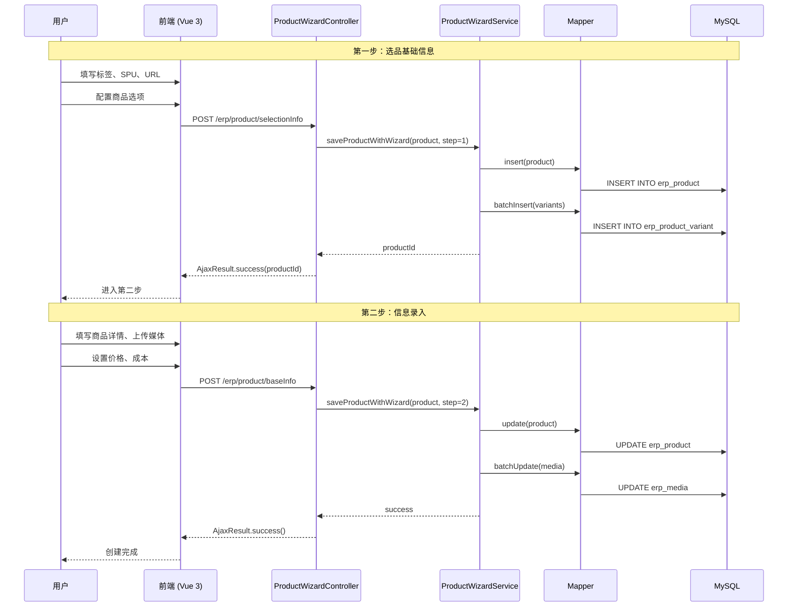
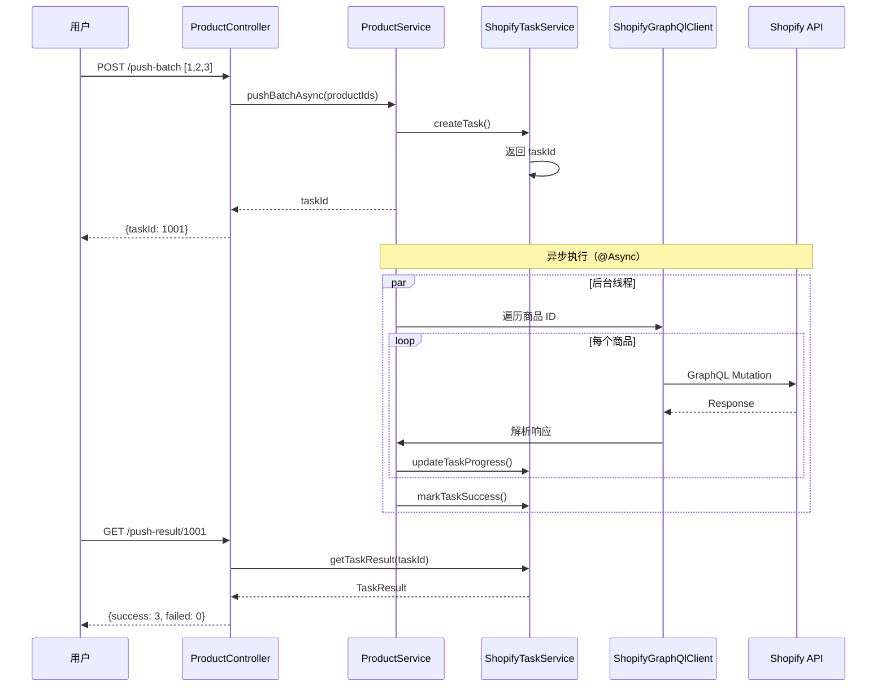
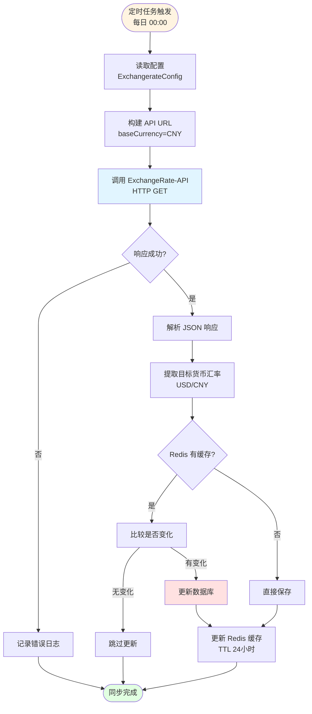
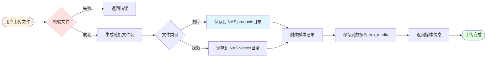

# vh-erp 模块开发指南

> **VH-ERP 业务模块** - LZ-RuoYi 系统的核心 ERP 业务模块，提供完整的商品管理、Shopify 集成、媒体资源管理等功能。

---

## 📋 目录

- [1. 模块职责](#1-模块职责)
- [2. 对外接口](#2-对外接口)
- [3. 依赖清单](#3-依赖清单)
- [4. 核心流程](#4-核心流程)
- [5. 配置项说明](#5-配置项说明)
- [6. 常见问题](#6-常见问题)
- [7. AI Coding 指南](#7-ai-coding-指南)

---

## 1. 模块职责

### 1.1 核心功能

vh-erp 模块负责以下核心业务：

| 功能域 | 职责描述 | 关键类 |
|--------|---------|--------|
| **商品管理** | 商品的 CRUD、导入导出、批量操作 | `ProductController`, `ProductServiceImpl` |
| **变体管理** | 商品变体的动态配置、SKU 生成 | `ProductVariantController`, `ProductVariantServiceImpl` |
| **标签管理** | 多级标签分类、级联选择、标签关联 | `TagDictController`, `TagDictServiceImpl` |
| **媒体管理** | 图片/视频上传、NAS 存储、拖拽排序 | `MediaController`, `MediaServiceImpl` |
| **Shopify 集成** | GraphQL API 对接、商品同步、任务管理 | `ShopifyTaskController`, `ShopifyTaskServiceImpl` |
| **汇率管理** | 汇率自动同步、缓存、查询 | `ExchangeRateController`, `ExchangeRateServiceImpl` |
| **商品向导** | 两步式商品创建流程 | `ProductWizardController`, `ProductWizardServiceImpl` |

### 1.2 模块边界

**✅ 本模块负责：**
- ERP 商品相关业务逻辑
- Shopify 平台集成
- 媒体文件管理
- 汇率数据同步
- 异步任务处理

**❌ 本模块不负责：**
- 用户认证授权（由 ruoyi-framework 负责）
- 系统管理（由 ruoyi-system 负责）
- 定时任务调度框架（由 ruoyi-quartz 负责）
- 代码生成（由 ruoyi-generator 负责）

### 1.3 包结构说明

```
com.ruoyi.erp/
├── config/              # 配置类
│   └── ExchangerateConfig.java    # 汇率 API 配置
├── constant/            # 常量定义
│   └── ErpConstants.java          # ERP 常量
├── controller/          # 控制器层（9个）
│   ├── ProductController.java           # 商品管理
│   ├── ProductVariantController.java    # 变体管理
│   ├── TagDictController.java           # 标签管理
│   ├── MediaController.java             # 媒体管理
│   ├── ImageController.java             # 图片管理
│   ├── ProductTagRelController.java     # 商品标签关联
│   ├── ExchangeRateController.java      # 汇率管理
│   ├── ShopifyTaskController.java       # Shopify 任务
│   └── ProductWizardController.java     # 商品创建向导
├── mapper/              # MyBatis-Plus Mapper（7个）
│   ├── ProductMapper.java
│   ├── ProductVariantMapper.java
│   ├── TagDictMapper.java
│   ├── MediaMapper.java
│   ├── ProductTagRelMapper.java
│   ├── ExchangeRateMapper.java
│   └── ShopifyTaskMapper.java
├── model/               # 领域模型
│   ├── domain/          # 实体类（10个）
│   │   ├── Product.java              # 商品主表
│   │   ├── ProductVariant.java       # 商品变体
│   │   ├── ProductOption.java        # 商品选项
│   │   ├── ProductOptionValue.java   # 选项值
│   │   ├── TagDict.java              # 标签字典
│   │   ├── ProductTagRel.java        # 商品标签关联
│   │   ├── Media.java                # 媒体资源
│   │   ├── Image.java                # 图片
│   │   ├── ShopifyTask.java          # Shopify 任务
│   │   └── ProductVariantOption.java # 变体选项
│   ├── dto/             # 数据传输对象（8个）
│   │   └── product/
│   │       ├── ProductQuery.java          # 商品查询条件
│   │       ├── ProductSelectionEdit.java  # 选品信息编辑
│   │       └── ProductBaseInfoEdit.java   # 基础信息编辑
│   └── vo/              # 视图对象（7个）
│       └── product/
│           └── ProductVo.java             # 商品视图对象
├── service/             # 服务层（10个）
│   ├── IProductService.java              # 商品服务接口
│   ├── IProductVariantService.java       # 变体服务接口
│   ├── ITagDictService.java              # 标签服务接口
│   ├── IMediaService.java                # 媒体服务接口
│   ├── IImageService.java                # 图片服务接口
│   ├── IProductTagRelService.java        # 商品标签关联服务
│   ├── IExchangeRateService.java         # 汇率服务接口
│   ├── IShopifyTaskService.java          # Shopify 任务服务
│   ├── IProductWizardService.java        # 商品向导服务
│   └── impl/                             # 实现类（9个）
└── task/                # 定时任务
    └── ExchangeRateTask.java             # 汇率同步任务
```

---

## 2. 对外接口

### 2.1 REST API 列表

#### 商品管理 (`/erp/product`)

| 方法 | 路径 | 权限标识 | 说明 |
|------|------|---------|------|
| GET | `/list` | `erp:product:list` | 查询商品列表 |
| GET | `/{productId}` | `erp:product:query` | 查询商品详情 |
| POST | `/selectionInfo` | `erp:product:add` | 保存选品信息（第一步） |
| POST | `/baseInfo` | `erp:product:edit` | 保存基础信息（第二步） |
| DELETE | `/{productIds}` | `erp:product:remove` | 删除商品 |
| POST | `/export` | `erp:product:export` | 导出商品数据 |
| POST | `/importData` | `erp:product:import` | 导入商品数据 |
| POST | `/importTemplate` | - | 下载导入模板 |
| POST | `/erp/product/push-batch` | `erp:product:push` | 批量推送到 Shopify |
| GET | `/push-result/{taskId}` | `erp:product:push` | 查询推送结果 |

#### 变体管理 (`/erp/variant`)

| 方法 | 路径 | 权限标识 | 说明 |
|------|------|---------|------|
| GET | `/list` | `erp:variant:list` | 查询变体列表 |
| GET | `/{variantId}` | `erp:variant:query` | 查询变体详情 |
| POST | `/` | `erp:variant:add` | 新增变体 |
| PUT | `/` | `erp:variant:edit` | 修改变体 |
| DELETE | `/{variantIds}` | `erp:variant:remove` | 删除变体 |

#### 标签管理 (`/erp/tag`)

| 方法 | 路径 | 权限标识 | 说明 |
|------|------|---------|------|
| GET | `/list` | `erp:tag:list` | 查询标签列表 |
| GET | `/treeselect` | `erp:tag:list` | 查询标签树形结构 |
| POST | `/` | `erp:tag:add` | 新增标签 |
| PUT | `/` | `erp:tag:edit` | 修改标签 |
| DELETE | `/{tagIds}` | `erp:tag:remove` | 删除标签 |

#### 媒体管理 (`/erp/media`)

| 方法 | 路径 | 权限标识 | 说明 |
|------|------|---------|------|
| GET | `/list` | `erp:media:list` | 查询媒体列表 |
| POST | `/upload` | `erp:media:upload` | 上传媒体文件 |
| DELETE | `/{mediaIds}` | `erp:media:remove` | 删除媒体 |
| GET | `/server-images` | `erp:media:list` | 从服务器加载图片 |

#### 汇率管理 (`/erp/exchange-rate`)

| 方法 | 路径 | 权限标识 | 说明 |
|------|------|---------|------|
| GET | `/latest` | `erp:exchange-rate:query` | 查询最新汇率 |
| GET | `/history` | `erp:exchange-rate:query` | 查询历史汇率 |
| POST | `/sync` | `erp:exchange-rate:sync` | 手动同步汇率 |

#### Shopify 任务 (`/erp/shopify-task`)

| 方法 | 路径 | 权限标识 | 说明 |
|------|------|---------|------|
| GET | `/list` | `erp:shopify-task:list` | 查询任务列表 |
| GET | `/{taskId}` | `erp:shopify-task:query` | 查询任务详情 |
| POST | `/retry` | `erp:shopify-task:edit` | 重试失败任务 |

### 2.2 请求/响应示例

#### 查询商品列表

**请求：**
```http
GET /erp/product/list?pageNum=1&pageSize=10&productName=测试&status=1
Authorization: Bearer <JWT_TOKEN>
```

**响应：**
```json
{
  "code": 200,
  "msg": "查询成功",
  "total": 100,
  "rows": [
    {
      "productId": 1,
      "spu": "SPU202604140001",
      "productTitle": "测试商品",
      "status": "1",
      "createTime": "2026-04-14 10:00:00"
    }
  ]
}
```

#### 保存选品信息（第一步）

**请求：**
```http
POST /erp/product/selectionInfo
Content-Type: application/json
Authorization: Bearer <JWT_TOKEN>

{
  "tagIds": [1, 2, 3],
  "spu": "SPU202604140001",
  "sourceUrl": "https://example.com/product",
  "purchaseUrl": "https://1688.com/product",
  "optionList": [
    {
      "purchaseName": "颜色",
      "productName": "Color",
      "values": [
        {"purchaseValue": "红色", "productValue": "Red"},
        {"purchaseValue": "蓝色", "productValue": "Blue"}
      ]
    }
  ],
  "variantList": [
    {
      "sku": "SKU-RED",
      "purchasePrice": 50.00,
      "purchaseUrl": "https://1688.com/variant1"
    }
  ]
}
```

**响应：**
```json
{
  "code": 200,
  "msg": "操作成功",
  "data": {
    "productId": 1
  }
}
```

#### 批量推送到 Shopify

**请求：**
```http
POST /erp/product/push-batch
Content-Type: application/json
Authorization: Bearer <JWT_TOKEN>

[1, 2, 3, 4, 5]
```

**响应：**
```json
{
  "code": 200,
  "msg": "操作成功",
  "data": {
    "taskId": 1001
  }
}
```

---

## 3. 依赖清单

### 3.1 Maven 依赖

```xml
<!-- vh-erp/pom.xml -->
<dependencies>
    <!-- 通用工具模块 -->
    <dependency>
        <groupId>com.ruoyi</groupId>
        <artifactId>ruoyi-common</artifactId>
    </dependency>

    <!-- MyBatis-Plus -->
    <dependency>
        <groupId>com.baomidou</groupId>
        <artifactId>mybatis-plus-spring-boot3-starter</artifactId>
        <version>${mybatis-plus.version}</version>
    </dependency>

    <!-- Spring Boot GraphQL Client -->
    <dependency>
        <groupId>org.springframework.boot</groupId>
        <artifactId>spring-boot-starter-graphql</artifactId>
    </dependency>

    <!-- WebClient (Spring GraphQL 底层依赖) -->
    <dependency>
        <groupId>org.springframework.boot</groupId>
        <artifactId>spring-boot-starter-webflux</artifactId>
    </dependency>
</dependencies>
```

### 3.2 间接依赖（通过 ruoyi-common）

- Spring Boot 3.5.11
- Spring Security + JWT
- MyBatis 3.0.5
- Druid 1.2.28
- PageHelper 2.1.1
- FastJSON2 2.0.61
- Hutool 5.8.38
- Lombok 1.18.36
- POI 4.1.2

### 3.3 外部服务依赖

| 服务 | 用途 | 配置项 | 文档 |
|------|------|--------|------|
| **Shopify GraphQL API** | 商品同步 | `shopify.base-url`<br>`shopify.admin-api-endpoint` | [Shopify API Docs](https://shopify.dev/docs/api/admin-graphql) |
| **ExchangeRate-API** | 汇率同步 | `exchange-rate.api-key`<br>`exchange-rate.base-url` | [ExchangeRate-API](https://www.exchangerate-api.com/) |
| **MySQL** | 数据存储 | `spring.datasource` | - |
| **Redis** | 缓存 | `spring.redis` | - |
| **NAS 存储** | 媒体文件 | `ruoyi.profile` | - |

### 3.4 模块依赖关系

```
vh-erp
├── 依赖 → ruoyi-common（通用工具）
├── 依赖 → ruoyi-framework（安全、拦截器）
├── 被依赖 → ruoyi-admin（应用入口）
└── 禁止依赖 → ruoyi-system、ruoyi-quartz、ruoyi-generator
```

---

## 4. 核心流程

### 4.1 商品创建流程（两步式向导）



**关键代码位置：**
- Controller: `ProductController.saveSelectionInfo()` / `saveProductBaseInfo()`
- Service: `ProductWizardServiceImpl.saveProductWithWizard()`
- 事务控制：`@Transactional(rollbackFor = Exception.class)`

### 4.2 Shopify 批量推送流程



**关键代码位置：**
- Controller: `ProductController.pushBatch()`
- Service: `ProductServiceImpl.pushBatchAsync()`
- 异步注解：`@Async("taskExecutor")`
- GraphQL 客户端: `ShopifyGraphQlClient`

### 4.3 汇率同步流程



**关键代码位置：**
- 定时任务: `ExchangeRateTask.updateExchangeRate()`
- 服务实现: `ExchangeRateServiceImpl.syncLatestRates()`
- 缓存注解: `@Cacheable(value = "exchange_rate")`

### 4.4 媒体文件上传流程



**关键代码位置：**
- Controller: `MediaController.upload()`
- Service: `MediaServiceImpl.uploadMedia()`
- 文件路径: `${ruoyi.profile}/erp-media/`

---

## 5. 配置项说明

### 5.1 配置文件位置

```
vh-erp/src/main/resources/application-erp-dev.yml
```

该文件会被 `ruoyi-admin` 模块的主配置文件引用：

```yaml
# ruoyi-admin/src/main/resources/application.yml
spring:
  profiles:
    active: dev,erp-dev  # 激活 erp-dev 配置
```

### 5.2 配置项详解

#### Shopify 配置

```yaml
shopify:
  base-url: https://test-shop.myshopify.com           # Shopify 店铺域名
  admin-api-endpoint: https://test-shop.myshopify.com/admin/api/2024-01  # API 端点
```

**环境变量方式（推荐生产环境）：**
```yaml
shopify:
  base-url: ${SHOPIFY_SHOP_DOMAIN}
  admin-api-endpoint: ${SHOPIFY_ADMIN_API_ENDPOINT}
```

#### 汇率 API 配置

```yaml
exchange-rate:
  api-key: 74d001f87bf041459e68fd9b          # API Key（从环境变量读取）
  base-url: https://v6.exchangerate-api.com/v6  # API 基础 URL
  connect-timeout: 5000                         # 连接超时（毫秒）
  read-timeout: 10000                           # 读取超时（毫秒）
  default-base-currency: USD                    # 基准货币
  target-currencies: CNY                        # 目标货币（多个用逗号分隔）
```

**配置类：** `ExchangerateConfig.java`

```java
@Data
@Component
@ConfigurationProperties(prefix = "exchange-rate")
public class ExchangerateConfig {
    private String apiKey;
    private String baseUrl;
    private Integer connectTimeout;
    private Integer readTimeout;
    private String defaultBaseCurrency;
    private String targetCurrencies;
}
```

#### 业务参数配置

```yaml
business:
  order-sync-interval: 30              # 订单同步间隔（秒）
  inventory-sync-interval: 60          # 库存同步间隔（秒）
  auto-sync-enabled: true              # 是否启用自动同步
  test-mode: true                      # 测试模式
  mock-data-enabled: true              # 模拟数据生成
```

#### 文件存储配置

```yaml
ruoyi:
  profile: C:/velarthome               # 文件存储根路径
  
  # Linux 生产环境示例：
  # profile: /home/ruoyi/uploadPath
```

**媒体文件实际路径：**
```
${ruoyi.profile}/erp-media/
├── products/
│   ├── {product_id}/
│   │   ├── main.jpg
│   │   ├── variant_1.jpg
│   │   └── video_1.mp4
│   └── ...
└── thumbnails/
```

#### 日志配置

```yaml
logging:
  level:
    com.ruoyi.erp: debug    # ERP 模块日志级别
    graphql: debug          # GraphQL 请求日志
```

**生产环境建议：**
```yaml
logging:
  level:
    com.ruoyi.erp: info
    graphql: warn
```

### 5.3 环境变量清单

生产环境必须设置的环境变量：

```bash
# Shopify 配置
export SHOPIFY_SHOP_DOMAIN="your-store.myshopify.com"
export SHOPIFY_ADMIN_API_ENDPOINT="https://your-store.myshopify.com/admin/api/2024-01"
export SHOPIFY_ACCESS_TOKEN="shpat_xxxxxxxxxxxx"

# 汇率 API 配置
export EXCHANGE_RATE_API_KEY="your_api_key"

# 数据库配置
export DB_PASSWORD="your_db_password"

# Redis 配置
export REDIS_PASSWORD="your_redis_password"

# 文件存储路径
export RUOYI_PROFILE="/home/ruoyi/uploadPath"
```

---

## 6. 常见问题

### 6.1 开发环境问题

#### Q1: Shopify API 调用失败？

**现象：**
```
graphql.GraphQlException: Failed to execute GraphQL request
```

**排查步骤：**
1. 检查 `shopify.base-url` 配置是否正确
2. 确认 Access Token 是否有效
3. 查看 API 速率限制（Shopify 限制每秒 2 次请求）
4. 检查网络连接

**解决方案：**
```yaml
# 检查配置
shopify:
  base-url: https://your-store.myshopify.com  # 确保域名正确
  admin-api-endpoint: https://your-store.myshopify.com/admin/api/2024-01

# 查看日志
logging:
  level:
    graphql: debug  # 开启 GraphQL 调试日志
```

#### Q2: 汇率同步失败？

**现象：**
```
ExchangeRate sync failed: 401 Unauthorized
```

**原因：** API Key 无效或过期

**解决方案：**
1. 登录 [ExchangeRate-API](https://www.exchangerate-api.com/) 检查 API Key
2. 确认配额是否用完
3. 更新配置文件中的 `exchange-rate.api-key`

#### Q3: 文件上传失败？

**现象：**
```
File upload failed: Permission denied
```

**原因：** NAS 存储路径权限不足

**解决方案：**
```bash
# Linux 环境
sudo chown -R ruoyi:ruoyi /home/ruoyi/uploadPath
sudo chmod -R 755 /home/ruoyi/uploadPath

# Windows 环境
# 检查文件夹权限，确保运行用户有写入权限
```

### 6.2 性能问题

#### Q4: 商品列表查询慢？

**可能原因：**
1. 缺少索引
2. N+1 查询问题
3. 未使用分页

**解决方案：**
```sql
-- 添加索引
CREATE INDEX idx_spu ON erp_product(spu);
CREATE INDEX idx_status ON erp_product(status);
CREATE INDEX idx_create_time ON erp_product(create_time DESC);
CREATE INDEX idx_product_id ON erp_product_variant(product_id);
```

```java
// 避免 N+1 查询
// ❌ 错误
for (Product product : products) {
    List<Variant> variants = variantMapper.selectByProductId(product.getId());
}

// ✅ 正确
List<Long> productIds = products.stream().map(Product::getId).collect(Collectors.toList());
Map<Long, List<Variant>> variantMap = variantMapper.selectByProductIds(productIds)
    .stream().collect(Collectors.groupingBy(Variant::getProductId));
```

#### Q5: 批量推送 Shopify 超时？

**原因：** 同步推送大量商品导致超时

**解决方案：**
```java
// 使用异步任务
@Async("taskExecutor")
@Transactional
public Long pushBatchAsync(List<Long> productIds) {
    // 异步执行，立即返回 taskId
}

// 前端轮询查询结果
GET /erp/product/push-result/{taskId}
```

### 6.3 数据一致性问题

#### Q6: 商品创建后标签流水号未更新？

**原因：** 事务未正确提交

**解决方案：**
```java
// 确保在 Service 层添加事务
@Override
@Transactional(rollbackFor = Exception.class)
public Long saveProductWithWizard(Product product, Integer step) {
    // 1. 保存商品
    productMapper.insert(product);
    
    // 2. 更新标签流水号
    tagService.updateSerialNumber(product.getTagIds());
    
    // 3. 保存变体
    variantMapper.batchInsert(product.getVariants());
    
    return product.getProductId();
}
```

#### Q7: Shopify 推送状态不一致？

**原因：** 异步任务异常未正确处理

**解决方案：**
```java
@Async("taskExecutor")
public void pushToShopify(Long productId) {
    Long taskId = createTask(productId);
    try {
        // 推送逻辑
        shopifyClient.createProduct(product);
        markTaskSuccess(taskId);
    } catch (Exception e) {
        log.error("Shopify 推送失败, productId: {}", productId, e);
        markTaskFailed(taskId, e.getMessage());
    }
}
```

### 6.4 缓存问题

#### Q8: 汇率数据不更新？

**原因：** Redis 缓存未失效

**解决方案：**
```java
// 手动清除缓存
@CacheEvict(value = "exchange_rate", allEntries = true)
public void clearExchangeRateCache() {
    log.info("汇率缓存已清除");
}

// 或者重启 Redis
redis-cli FLUSHDB
```

---

## 7. AI Coding 指南

### 7.1 给通义灵码/Trae 的提示

在为本模块生成代码时，请遵循以下规则：

#### 后端代码生成

```
请为 vh-erp 模块生成代码，要求：

1. 包路径：com.ruoyi.erp.{controller|service|mapper|model}
2. 使用 @Resource 注入依赖（不用 @Autowired）
3. Controller 添加 @PreAuthorize 权限注解
4. Controller 添加 @Log 操作日志注解
5. Service 层需要事务时添加 @Transactional(rollbackFor = Exception.class)
6. 使用 MyBatis-Plus LambdaQueryWrapper 查询
7. 统一返回 AjaxResult 或 TableDataInfo
8. 实体类使用 Lombok @Data 注解
9. 避免 N+1 查询，使用批量查询
10. 敏感配置从环境变量读取

参考现有代码风格：
- ProductController.java
- ProductServiceImpl.java
- ProductMapper.java
```

#### 前端代码生成

```
请为 RuoYi-Vue3 生成 ERP 相关前端代码，要求：

1. 文件位置：RuoYi-Vue3/src/views/erp/{module}/
2. 使用 Vue 3 Composition API (<script setup>)
3. 必须定义组件 name 属性
4. 使用 Element Plus 组件
5. API 调用使用封装的 request 工具
6. 按钮添加 v-hasPermi 权限控制
7. 表格使用 el-table + Pagination 组件
8. 表单使用 el-form + 验证规则
9. 图片使用 el-image 懒加载
10. 搜索框使用防抖

参考现有代码风格：
- RuoYi-Vue3/src/views/erp/product/index.vue
- RuoYi-Vue3/src/api/erp/product.js
```

### 7.2 代码模板

#### Controller 模板

```java
package com.ruoyi.erp.controller;

import com.ruoyi.common.annotation.Log;
import com.ruoyi.common.core.controller.BaseController;
import com.ruoyi.common.core.domain.AjaxResult;
import com.ruoyi.common.core.page.TableDataInfo;
import com.ruoyi.common.enums.BusinessType;
import com.ruoyi.erp.model.domain.YourEntity;
import com.ruoyi.erp.service.IYourService;
import jakarta.annotation.Resource;
import org.springframework.security.access.prepost.PreAuthorize;
import org.springframework.web.bind.annotation.*;

import java.util.List;

/**
 * XXX 管理 Controller
 *
 * @author your-name
 * @date 2026-04-14
 */
@RestController
@RequestMapping("/erp/your-module")
public class YourController extends BaseController {
    
    @Resource
    private IYourService yourService;

    /**
     * 查询列表
     */
    @PreAuthorize("@ss.hasPermi('erp:your-module:list')")
    @GetMapping("/list")
    public TableDataInfo list(YourEntity entity) {
        startPage();
        List<YourEntity> list = yourService.selectList(entity);
        return getDataTable(list);
    }

    /**
     * 获取详情
     */
    @PreAuthorize("@ss.hasPermi('erp:your-module:query')")
    @GetMapping("/{id}")
    public AjaxResult getInfo(@PathVariable Long id) {
        return success(yourService.selectById(id));
    }

    /**
     * 新增
     */
    @PreAuthorize("@ss.hasPermi('erp:your-module:add')")
    @Log(title = "XXX管理", businessType = BusinessType.INSERT)
    @PostMapping
    public AjaxResult add(@RequestBody YourEntity entity) {
        return toAjax(yourService.insert(entity));
    }

    /**
     * 修改
     */
    @PreAuthorize("@ss.hasPermi('erp:your-module:edit')")
    @Log(title = "XXX管理", businessType = BusinessType.UPDATE)
    @PutMapping
    public AjaxResult edit(@RequestBody YourEntity entity) {
        return toAjax(yourService.update(entity));
    }

    /**
     * 删除
     */
    @PreAuthorize("@ss.hasPermi('erp:your-module:remove')")
    @Log(title = "XXX管理", businessType = BusinessType.DELETE)
    @DeleteMapping("/{ids}")
    public AjaxResult remove(@PathVariable Long[] ids) {
        return toAjax(yourService.deleteByIds(ids));
    }
}
```

#### Service 模板

```java
package com.ruoyi.erp.service.impl;

import com.baomidou.mybatisplus.core.conditions.query.LambdaQueryWrapper;
import com.baomidou.mybatisplus.extension.service.impl.ServiceImpl;
import com.ruoyi.common.exception.ServiceException;
import com.ruoyi.erp.mapper.YourMapper;
import com.ruoyi.erp.model.domain.YourEntity;
import com.ruoyi.erp.service.IYourService;
import jakarta.annotation.Resource;
import lombok.extern.slf4j.Slf4j;
import org.springframework.stereotype.Service;
import org.springframework.transaction.annotation.Transactional;

import java.util.List;

/**
 * XXX 服务实现类
 *
 * @author your-name
 * @date 2026-04-14
 */
@Slf4j
@Service
public class YourServiceImpl extends ServiceImpl<YourMapper, YourEntity> implements IYourService {

    @Resource
    private YourMapper yourMapper;

    @Override
    public List<YourEntity> selectList(YourEntity entity) {
        LambdaQueryWrapper<YourEntity> wrapper = new LambdaQueryWrapper<>();
        // 构建查询条件
        if (entity.getName() != null) {
            wrapper.like(YourEntity::getName, entity.getName());
        }
        wrapper.orderByDesc(YourEntity::getCreateTime);
        return yourMapper.selectList(wrapper);
    }

    @Override
    public YourEntity selectById(Long id) {
        YourEntity entity = yourMapper.selectById(id);
        if (entity == null) {
            throw new ServiceException("数据不存在");
        }
        return entity;
    }

    @Override
    @Transactional(rollbackFor = Exception.class)
    public int insert(YourEntity entity) {
        // 业务校验
        if (entity.getName() == null) {
            throw new ServiceException("名称不能为空");
        }
        
        // 插入数据
        int rows = yourMapper.insert(entity);
        log.info("新增成功, id: {}", entity.getId());
        return rows;
    }

    @Override
    @Transactional(rollbackFor = Exception.class)
    public int update(YourEntity entity) {
        if (entity.getId() == null) {
            throw new ServiceException("ID 不能为空");
        }
        
        int rows = yourMapper.updateById(entity);
        log.info("更新成功, id: {}", entity.getId());
        return rows;
    }

    @Override
    @Transactional(rollbackFor = Exception.class)
    public int deleteByIds(Long[] ids) {
        int rows = yourMapper.deleteBatchIds(java.util.Arrays.asList(ids));
        log.info("删除成功, 数量: {}", rows);
        return rows;
    }
}
```

### 7.3 最佳实践检查清单

生成代码后，AI 应自检：

#### 后端检查
- [ ] 包路径是否正确（com.ruoyi.erp.*）？
- [ ] 是否使用 `@Resource` 而非 `@Autowired`？
- [ ] Controller 是否添加 `@PreAuthorize` 和 `@Log`？
- [ ] Service 是否需要事务（`@Transactional`）？
- [ ] 是否使用 `LambdaQueryWrapper` 而非字符串字段名？
- [ ] 是否避免了 N+1 查询？
- [ ] 是否有空指针防护？
- [ ] 是否添加了 Javadoc 注释？
- [ ] 异常处理是否正确（ServiceException）？
- [ ] 返回值是否统一（AjaxResult/TableDataInfo）？

#### 前端检查
- [ ] 文件是否在 `RuoYi-Vue3/src/views/erp/` 目录？
- [ ] 是否使用 `<script setup>` 语法？
- [ ] 是否定义了组件 `name` 属性？
- [ ] 按钮是否添加 `v-hasPermi` 权限？
- [ ] 是否使用封装的 `request` 工具？
- [ ] 图片是否使用 `el-image` 懒加载？
- [ ] 是否有加载状态（v-loading）？
- [ ] 是否有错误处理？

---

## 8. 总结

### 8.1 模块特点

✅ **完整的 ERP 商品管理**：从选品到上架的全流程  
✅ **Shopify 深度集成**：GraphQL API 无缝对接  
✅ **灵活的变体系统**：支持多维度商品规格  
✅ **智能媒体管理**：图片/视频统一管理，拖拽排序  
✅ **自动化汇率同步**：定时任务 + Redis 缓存  
✅ **异步任务处理**：批量操作不阻塞  

### 8.2 技术亮点

- **MyBatis-Plus**：简化 CRUD，类型安全查询
- **Spring GraphQL**：现代化的 GraphQL 客户端
- **Spring Cache**：声明式缓存管理
- **@Async 异步**：非阻塞批量处理
- **Lombok**：减少样板代码
- **若依框架**：成熟的安全、权限、日志体系

### 8.3 快速开始

```bash
# 1. 配置环境变量
export SHOPIFY_SHOP_DOMAIN="your-store.myshopify.com"
export SHOPIFY_ACCESS_TOKEN="shpat_xxx"
export EXCHANGE_RATE_API_KEY="your_key"

# 2. 启动后端
cd ruoyi-admin
mvn spring-boot:run

# 3. 启动前端
cd RuoYi-Vue3
npm run dev

# 4. 访问系统
# http://localhost:80
# 账号: admin
# 密码: admin123
```

---

**文档版本：** v1.0  
**最后更新：** 2026-04-14  
**维护团队：** LZ-RuoYi Team  
**适用工具：** 通义灵码、Trae、Cursor 等 AI 编程助手
